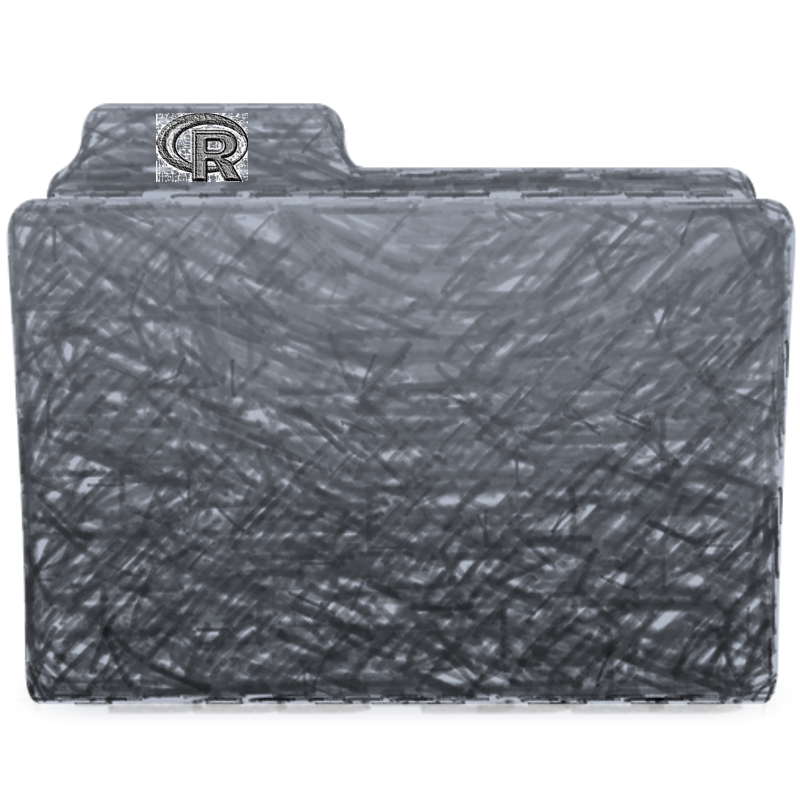

# rdir


[](https://travis-ci.org/trinker/pax)
[](https://coveralls.io/r/rdir/trinker?branch=master)
<a href="https://img.shields.io/badge/Version-0.0.1-orange.svg"></a></p>

**rdir** is a Windows based package for working with directories.  

  

## Installation

To download the development version of **rdir**:

Download the [zip ball](https://github.com/trinker/rdir/zipball/master) or [tar ball](https://github.com/trinker/rdir/tarball/master), decompress and run `R CMD INSTALL` on it, or use the **pacman** package to install the development version:

```r
if (!require("pacman")) install.packages("pacman")
pacman::p_load_gh("trinker/rdir")
```

## Contact

You are welcome to:
* submit suggestions and bug-reports at: <https://github.com/trinker/rdir/issues>
* send a pull request on: <https://github.com/trinker/rdir/>
* compose a friendly e-mail to: <tyler.rinker@gmail.com>
